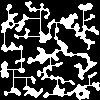

# proc-map-gen

procedural map generation based on cellular automata




Usage:
```javascript
const c = ProcCaveGen.init()
ProcCaveGen.Build(c)
ProcCaveGen.ConnectCaves(c)
```


## debugging

How to run the server through the chrome debugger.

Open chrome://inspect in the browser

Then:
```bash
node --inspect index.js
```


## references
This is a pretty direct port of https://github.com/AndyStobirski/RogueLike/blob/master/csCaveGenerator.cs

The original blog that talks about this is gone but you can still see an archived copy at https://web.archive.org/web/20211024235813/http://www.evilscience.co.uk/a-c-algorithm-to-build-roguelike-cave-systems-part-1/

Eventually I'd like to apply some of the changes Kyzrati talks about in https://www.gridsagegames.com/blog/2014/06/mapgen-cellular-automata/ namely the "guided generation" and "U shape cave removal"
